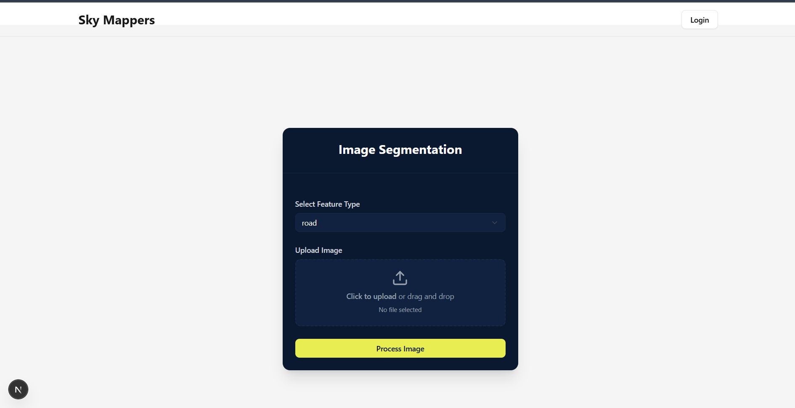
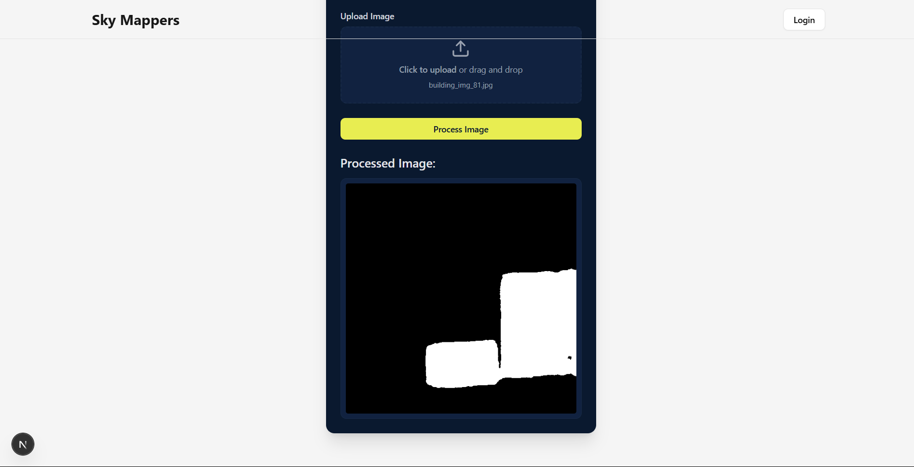
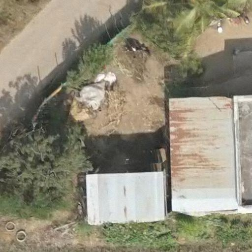

# 🌐 Sky Mappers

**Sky Mappers** is a full-stack geospatial intelligence platform that allows users to upload aerial or satellite imagery and perform **semantic segmentation** to detect key infrastructure and land-use features using AI. The platform is built using:

- 🔧 **Frontend**: [Next.js](https://nextjs.org/) (React)
- 🔧 **Backend**: [Django](https://www.djangoproject.com/) (Django REST Framework)

---

## 🧠 What It Can Detect

Sky Mappers can segment:

- 🏢 **Buildings**
- 🛣️ **Roads**
- 🌊 **Water Bodies**
- 🏡 **Rooftop Types**:
  - RCC (Reinforced Cement Concrete)
  - Tiled Roofs
  - Asbestos Sheets

---

## 🔐 Authentication

The application includes:

- 🧾 **User Registration**
- 🔐 **Login System**
- 🔓 **Token-based Authentication (JWT or Session-based)**
- ✅ Protected routes for uploading and processing imagery

---

## 📦 Key Features

- 📤 Upload high-resolution drone/satellite images
- 🧠 AI-based backend segmentation for multiple land features
- 🧭 Choose the target feature type before processing
- 📈 View segmented output instantly in the frontend
- 🔄 REST API integration between frontend & backend
- 🛡️ Authenticated access to segmentation tools

---

## 🖼️ Screenshots

### 🔘 UI Before Upload


### 🧠 Processed Image Output


### 🌍 Sample Input Image (Drone View)


---

## 📁 Project Structure

```text
Sky_Mappers/
├── Backend/
│   ├── manage.py
│   ├── requirements.txt
│   └── sky_mappers/
│       ├── __init__.py
│       ├── settings.py         # CORS, DRF, authentication config
│       ├── urls.py
│       ├── api/                # Django app: image processing APIs
│       └── users/              # Django app: login & registration
├── terraview/
│   ├── package.json
│   ├── pages/
│   │   ├── index.js            # Home / Upload page
│   │   ├── login.js            # Login component
│   │   └── register.js         # Register component
│   ├── components/
│   │   └── ImagePreview.js
│   ├── public/
│   │   └── [static images & favicon]
│   └── styles/
│       └── globals.css
└── README.md
